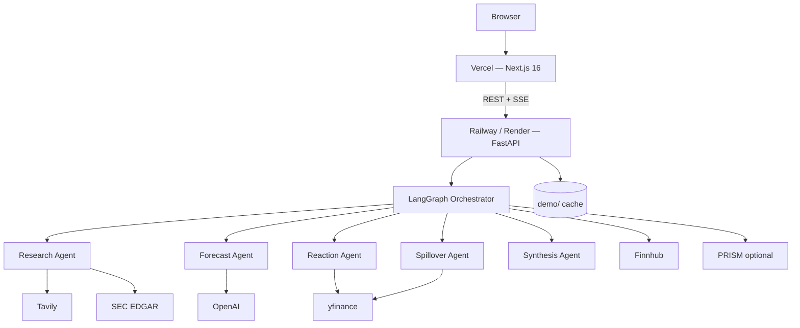

# EarningsPulse — Deployment Guide

Production deployment uses **Vercel** (frontend) + **Railway** or **Render** (backend). Docker Compose remains the recommended local path.

---

## Architecture (production)



| Component | Platform | URL pattern |
|-----------|----------|-------------|
| Frontend | Vercel | `https://<project>.vercel.app` |
| Backend API | Railway or Render | `https://<service>.up.railway.app` or `https://<service>.onrender.com` |

---

## Prerequisites

- GitHub repo connected to Vercel and Railway/Render
- API keys from `.env.example` (OpenAI, Tavily, Finnhub minimum for live generation)
- Demo cache committed at `backend/demo/aapl.json` (included in repo)

---

## Step 1 — Deploy backend (Railway)

1. Create a new project at [railway.app](https://railway.app) → **Deploy from GitHub repo**.
2. Add a service and set **Root Directory** to `backend`.
3. Railway detects `backend/Dockerfile` and `backend/railway.toml` automatically.
4. Set **environment variables** (Settings → Variables):

| Variable | Required | Example |
|----------|----------|---------|
| `ENVIRONMENT` | Yes | `production` |
| `FRONTEND_URL` | Yes | `https://your-app.vercel.app` |
| `OPENAI_API_KEY` | Yes (live gen) | `sk-...` |
| `TAVILY_API_KEY` | Yes (live gen) | `tvly-...` |
| `FINNHUB_API_KEY` | Recommended | `...` |
| `SEC_USER_AGENT` | Yes | `EarningsPulse you@email.com` |
| `PRISM_API_KEY` | Optional | From hackathon |
| `PRISM_PROJECT_ID` | Optional | From hackathon |

`FRONTEND_URL` is automatically merged into CORS — no manual `CORS_ORIGINS` needed unless you have multiple frontend domains.

5. Generate a public domain (Settings → Networking → **Generate Domain**).
6. Confirm health: `curl https://<your-api>/health`

### Alternative — Render

1. Connect repo at [render.com](https://render.com).
2. Use the included `render.yaml` blueprint, or create a **Web Service** manually:
   - Root directory: `backend`
   - Dockerfile path: `backend/Dockerfile`
   - Health check path: `/health`
3. Set the same environment variables as above.

---

## Step 2 — Deploy frontend (Vercel)

1. Import the repo at [vercel.com](https://vercel.com).
2. Set **Root Directory** to `frontend`. If that setting is left empty, the repo-root `vercel.json` plus the `frontend/` pointers still let Git deploys detect Next.js. Prefer the dashboard setting so file tracing stays inside `frontend/`.
3. Framework preset: **Next.js** (auto-detected).
4. Set environment variable:

| Variable | Value |
|----------|-------|
| `NEXT_PUBLIC_BACKEND_URL` | `https://<your-railway-or-render-api-url>` |

5. Deploy. Vercel detects **Bun** from `frontend/bun.lock` and uses `frontend/vercel.json` (`bun install --frozen-lockfile`, then `bun run build` on Node). Do not enable the Bun Function runtime (`bunVersion`).

---

## Step 3 — Link frontend ↔ backend

After Vercel gives you a production URL:

1. Update Railway/Render **`FRONTEND_URL`** to your Vercel URL (e.g. `https://earningspulse.vercel.app`).
2. Redeploy the backend so CORS picks up the new origin.
3. Confirm `NEXT_PUBLIC_BACKEND_URL` on Vercel points to the backend URL.
4. Redeploy frontend if you changed the backend URL.

---

## Step 4 — Verify production

```bash
chmod +x scripts/verify_deployment.sh

./scripts/verify_deployment.sh \
  https://your-api.up.railway.app \
  https://your-app.vercel.app
```

Manual checks:

- [ ] Home page loads; disclaimer visible
- [ ] **Demo AAPL** loads instantly (no API keys needed)
- [ ] Live ticker generation completes in < 2 minutes
- [ ] Agent trace panel streams during generation
- [ ] JSON export downloads
- [ ] Calendar page loads

---

## Environment variables reference

See [`.env.example`](../.env.example) for the full list.

### Production-only notes

- **`ENVIRONMENT=production`** — surfaced in `/health` response
- **`FRONTEND_URL`** — must match your Vercel domain exactly (including `https://`)
- **`PORT`** — injected automatically by Railway/Render; Dockerfile respects it
- **`NEXT_PUBLIC_BACKEND_URL`** — baked at Vercel build time; redeploy after changes

### Optional overrides

```bash
# Only if you need multiple allowed origins (preview deploys, custom domain)
CORS_ORIGINS=["https://earningspulse.vercel.app","https://preview.vercel.app"]
```

---

## Docker (self-hosted)

```bash
cp .env.example .env
# Set FRONTEND_URL and API keys

docker compose up --build
```

For production Docker, set build args on the frontend service:

```yaml
args:
  NEXT_PUBLIC_BACKEND_URL: https://api.yourdomain.com
```

---

## Demo reliability in production

| Mode | API keys | Use case |
|------|----------|----------|
| **Demo AAPL** | None | Hackathon pitch, CI, offline fallback |
| **Live generation** | OpenAI + Tavily + Finnhub | Full product demo |

Pre-warm before presenting:

```bash
curl -X POST https://your-api/api/playbook/demo/AAPL
curl -X POST https://your-api/api/playbook/generate \
  -H "Content-Type: application/json" \
  -d '{"ticker":"AAPL"}'
```

See [DEMO_SCRIPT.md](./DEMO_SCRIPT.md) for the 3-minute pitch flow.

---

## Release tagging

After production is verified:

```bash
git checkout main
git pull
git tag -a v1.0.0 -m "EarningsPulse v1.0.0 — hackathon release"
git push origin v1.0.0
```

---

## Troubleshooting

| Symptom | Fix |
|---------|-----|
| CORS error in browser | Set `FRONTEND_URL` on backend to exact Vercel URL; redeploy backend |
| Demo AAPL 404 | Ensure `backend/demo/aapl.json` is in the Docker image (included in Dockerfile) |
| Vercel platform `NOT_FOUND` (black error page, not the Next.js 404) | The Git project built the repo root with no Next.js app. Set Root Directory to `frontend` and Redeploy, or keep the repo-root `package.json` / `next.config.ts` pointers so zero-config can see the app |
| Frontend can't reach API | Check `NEXT_PUBLIC_BACKEND_URL`; redeploy Vercel after changing it |
| Generation fails | Check `/ready` for missing keys; verify OpenAI/Tavily quotas |
| SSE stream disconnects | Confirm backend URL is HTTPS; some proxies need longer timeouts |

---

## HTTPS

Both Vercel and Railway/Render provide HTTPS by default. No additional TLS configuration required.
